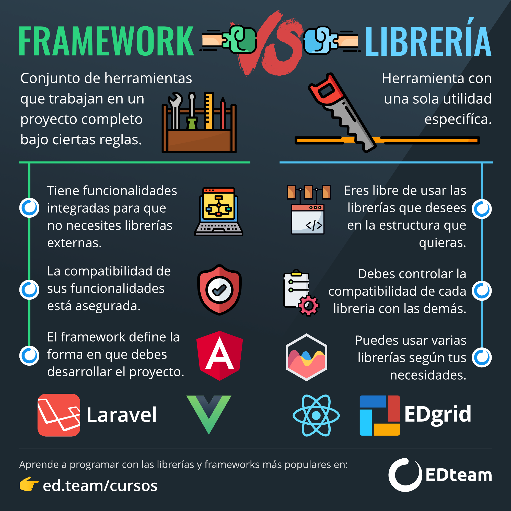

# BIBLIOTECA E FRAMEWORK

> Quando entramos na programação repetimos muitos códigos,
> somos como o Bart Simpson.  
> Mas no mundo do desenvolvimento de software 
> queremos construir aplicações muito mais rápido 
> e para nos ajudar nessa missão usaremos
> as bibliotecas e frameworks. 

## BIBLIOTECA 
A biblioteca é um conjunto de elementos (funções, classes, constantes, variáveis, etc), que resolvem necessidades específicas do projeto, empacotadas e reutilizáveis. 
Portanto cada vez que empacotas funcionalidades, está criando uma biblioteca. 
Em conclusão, podemos dizer que uma biblioteca (do inglês library)  é uma coleção de códigos voltados a resolver um determinado tipo de problema.

### EXEMPLOS DE BIBLIOTECA (PARA JS)
- **React**: Biblioteca para criar interfaces de usuário. 
- **Moment.js**: Biblioteca para converter, validar, manipular e exibir datas e horários
- **Chart.js**: Biblioteca para a criação de gráficos
- **Voca**: Biblioteca para trabalhar com Strings
- **Mo.js**: Biblioteca para criar animações incríveis com SVG. 

## FRAMEWORK 
Um framework é uma coleção de várias funcionalidades prontas, e normalmente já possuem um fluxo de trabalho ou estrutura a serem seguidos (estruturado). É algo bem mais abstrato do que uma biblioteca. E que tem como finalidade nos ajudar na construção web ou app. 
O foco dos frameworks é mais amplo que das bibliotecas. Aliás, um framework pode ser feito a partir de uma coleção de padrões, APIs e até mesmo de bibliotecas. 

### EXEMPLO DE FRAMEWORK (PARA JS)
- **Angular**: Framework para criação de aplicações web
- **Vue.js**: Framework também para criação de aplicações web
- **Ionic**: Framework para criar aplicativos mobile com Angular, React ou Vue
- **Express**: Framework para criar aplicações com Node.js
- **LoopBack**: Framework para criar APIs e microserviços com Node.js

### QUAL A DIFERENÇA ENTRE FRAMEWORK E BIBLIOTECA? 
Como exemplos valem mais que mil palavras, apresento o fluxograma abaixo que exemplifica as principais características e diferenças entre framework e biblioteca. 

Portanto concluímos que no framework ganhamos produtividade com baixa flexibilidade. E na biblioteca temos mais liberdade. 
E além de tudo que já foi dito aqui, podemos notar que normalmente as bibliotecas são usadas pelos nossos códigos, enquanto os frameworks é quem costumam utilizar os nossos códigos.

### ENTÃO, QUAL DEVO ESCOLHER? 
Isso depende do que você está fazendo. 
A biblioteca te dar liberdade porque pode usar mais de uma biblioteca mas na contrapartida tem que ficar atenta para a compatibilidade. 
Já no framework você não precisa se preocupar com compatibilidade, porque ele já te dar todas as ferramentas dentro de um fluxo já estabelecido. O que te limita a flexibilidade. 
Mas nenhum é melhor que o outro, só tem enfoques diferentes para propósitos diferentes. 
O importante é saber a diferença entre eles e onde aplicar. Portanto não confunda, React é uma biblioteca, onde você escolhe as funções e como vai organizar elas, e Angular é um framework, onde todas as funcionalidades estão incluídas num fluxo definido. 

#### REFERÊNCIAS
1. LINK ACESSADO DIA 10/08/2020 - https://es.stackoverflow.com/questions/23239/que-diferencia-existe-entre-api-biblioteca-y-framework
2. LINK ACESSADO DIA 10/08/2020 https://www.treinaweb.com.br/blog/qual-a-diferenca-entre-framework-e-biblioteca/
3. LINK ACESSADO NO DIA 14/08/2020 https://www.arquitecturajava.com/framework-vs-libreria/

**Feito por Jessica Montenegro** :woman_technologist:

