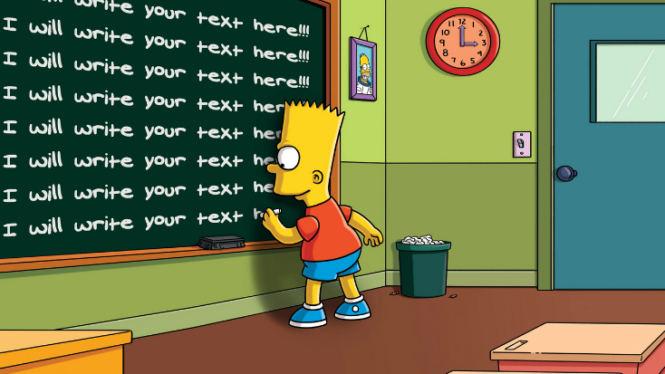

reprograma-homework-1

# BIBLIOTECA E FRAMEWORK

> Quando entramos na programação repetimos muitos códigos,
> somos como o Bart Simpson.  
> Mas no mundo do desenvolvimento de software 
> queremos construir aplicações muito mais rápido 
> e para nos ajudar nessa missão usaremos
> as bibliotecas e frameworks. 

### BIBLIOTECA 
A biblioteca é um conjunto de elementos, que resolvem necessidades específicas do projeto, empacotadas e reutilizáveis. 
es un conjunto de elementos (funciones, clases, tipos predefinidos, constantes, variables globales, macros, etc) que es posible utilizar en un programa para facilitar la implementación de 
ese programaPortanto cada vez que empacotas funcionalidades, está criando uma biblioteca. 

